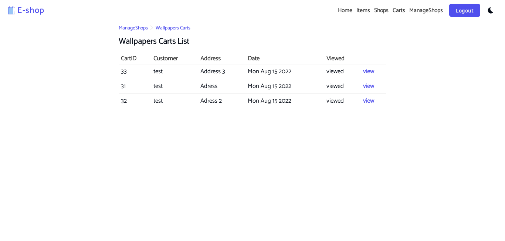

# Introduction

This is an web interface for the e-shop REST API [https://github.com/seif-baazouzi/eshop-api](https://github.com/seif-baazouzi/eshop-api)

# Quick Start

```console
$ npm i
$ npm run dev
```

# Pages

### Home Page


### Items Page


### Shops Page


### Login Page


### Signup Page


### Carts Page


### Manage Shops Page


### Manage Shop items Page


### Shop Carts Page



### Cart Items List Page


### Settings Page


# Dark Mode


# Used Icons

- https://www.reshot.com/free-svg-icons/item/shopping-bag-746ADUHMLG/
- https://www.reshot.com/free-svg-icons/item/product-stack-56JW3AE8CP/
- https://www.reshot.com/free-svg-icons/item/food-cart-L7TJKFSNRV/
- https://www.reshot.com/free-svg-icons/item/store-ZRPJNH793Y/